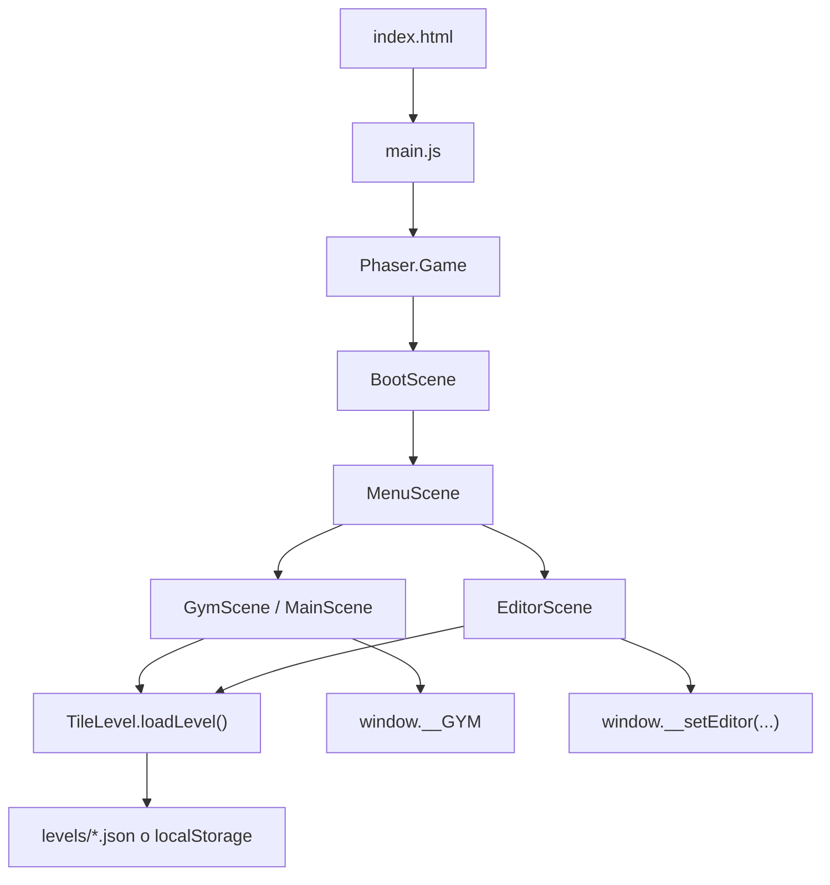

# Documentacion Tecnica

## 1. Resumen

`Gatito-Code` es un juego educativo 2D hecho con Phaser 3 y ES Modules nativos. El proyecto combina:

- Un runtime jugable basado en grillas y secuencias de movimientos.
- Un editor visual de niveles integrado en la misma aplicacion.
- Persistencia local en `localStorage` para iterar niveles sin backend.

La aplicacion corre enteramente en el navegador y se sirve como sitio estatico desde la carpeta [`public/`](../public/).

## 2. Objetivo funcional

El jugador programa una secuencia corta de instrucciones de movimiento (`up`, `down`, `left`, `right`) y luego la ejecuta para desplazar al personaje sobre un mapa de tiles, evitando celdas solidas y recolectando objetos.

El editor permite modificar:

- La capa de piso.
- La capa de colisiones/paredes.
- El punto de spawn.
- Objetos de tipo `pickup` y `deco`.

## 3. Stack y decisiones tecnicas

- Motor: Phaser 3.80.1 cargado por CDN.
- Modulos: ES Modules nativos del browser.
- Build: no hay bundler, transpiler ni pipeline de empaquetado.
- Backend: inexistente.
- Persistencia: `localStorage` del navegador.
- Assets: sprites y tilesets de Sprout Lands.

Consecuencias de esta arquitectura:

- El proyecto es facil de levantar y mover.
- La carga de modulos y assets requiere HTTP; `file://` no funciona.
- Toda la logica de UI lateral vive en DOM tradicional, no dentro de Phaser.
- El editor y el juego comparten el mismo contrato de datos de nivel.

## 4. Estructura del repositorio

```text
Gatito-Code/
├── README.md
├── docs/
│   └── documentacion-tecnica.md
└── public/
    ├── index.html
    ├── assets/
    ├── levels/
    │   ├── gym.json
    │   └── main.json
    └── src/
        ├── main.js
        ├── level/
        │   └── TileLevel.js
        └── scenes/
            ├── BootScene.js
            ├── MenuScene.js
            ├── GymScene.js
            ├── MainScene.js
            ├── TileLevelScene.js
            └── EditorScene.js
```

## 5. Arquitectura general

La aplicacion se divide en tres capas:

### 5.1. Bootstrap del juego

[`public/src/main.js`](/Users/iarabaya/Programacion/Gatito-Code/public/src/main.js) crea la instancia de `Phaser.Game` y define constantes globales de tablero:

- `TILE = 16`
- `COLS = 16`
- `ROWS = 12`

Tambien registra las escenas en este orden:

1. `BootScene`
2. `MenuScene`
3. `GymScene`
4. `MainScene`
5. `EditorScene`

### 5.2. Capa de dominio de niveles

[`public/src/level/TileLevel.js`](/Users/iarabaya/Programacion/Gatito-Code/public/src/level/TileLevel.js) es el nucleo compartido del proyecto. Centraliza:

- Registro de tilesets y GIDs canonicos.
- Registro de objetos disponibles en el editor.
- Definicion de terrenos con autotile por bitmask.
- Carga y resolucion de JSON de niveles.
- Construccion del `tilemap` de Phaser.

Es el modulo mas importante para mantener coherencia entre juego y editor.

### 5.3. Capa de presentacion

Se parte en dos subsistemas:

- Escenas Phaser para render, gameplay y edicion.
- UI HTML/CSS/JS en [`public/index.html`](/Users/iarabaya/Programacion/Gatito-Code/public/index.html) para paneles, cola de comandos, dialogos y paleta del editor.

La comunicacion entre ambos lados ocurre via funciones globales en `window`.

## 6. Flujo de escenas

### 6.1. `BootScene`

Archivo: [`public/src/scenes/BootScene.js`](/Users/iarabaya/Programacion/Gatito-Code/public/src/scenes/BootScene.js)

Responsabilidades:

- Precargar el spritesheet del personaje.
- Precargar sprites de objetos.
- Precargar tilesets y niveles via `preloadAssets`.
- Cargar `assets/ui.json`, que funciona como manifiesto de assets UI.
- Crear animaciones del personaje (`walk_*`, `idle_*`).
- Cargar dinamicamente texturas/animaciones UI faltantes y luego arrancar `Menu`.

### 6.2. `MenuScene`

Archivo: [`public/src/scenes/MenuScene.js`](/Users/iarabaya/Programacion/Gatito-Code/public/src/scenes/MenuScene.js)

Responsabilidades:

- Ocultar paneles de juego y editor.
- Dibujar y actualizar las distintas pantallas del menu.
- Permitir navegar por teclado o mouse.
- Redirigir a niveles, editor o creditos segun la opcion seleccionada.

Navegacion disponible:

- Pantalla principal:
  - `Levels`
  - `Level Editor`
  - `Credits`
- Pantallas secundarias:
  - `Back`

### 6.3. `TileLevelScene`

Archivo: [`public/src/scenes/TileLevelScene.js`](/Users/iarabaya/Programacion/Gatito-Code/public/src/scenes/TileLevelScene.js)

Es la clase base para niveles jugables. Implementa:

- Carga del nivel con `loadLevel`.
- Resolucion de spawn.
- Matriz de colisiones.
- Ejecucion secuencial del programa del jugador.
- Deteccion y animacion de pickups.
- Grid de debug, HUD tecnico y controles auxiliares.

Subclases:

- [`GymScene`](/Users/iarabaya/Programacion/Gatito-Code/public/src/scenes/GymScene.js)
- [`MainScene`](/Users/iarabaya/Programacion/Gatito-Code/public/src/scenes/MainScene.js)

### 6.4. `GymScene`

Archivo: [`public/src/scenes/GymScene.js`](/Users/iarabaya/Programacion/Gatito-Code/public/src/scenes/GymScene.js)

Configura:

- `levelKey = 'gym'`
- `welcomeMessage` con dialogo tutorial

No redefine logica de gameplay; hereda todo desde `TileLevelScene`.

### 6.5. `MainScene`

Archivo: [`public/src/scenes/MainScene.js`](/Users/iarabaya/Programacion/Gatito-Code/public/src/scenes/MainScene.js)

Configura:

- `levelKey = 'main'`

Ademas redefine `decorate()` para agregar pickups hardcodeados encima del contenido del JSON. Esto implica que el nivel `main` hoy mezcla:

- Objetos definidos en el archivo de nivel.
- Pickups agregados por codigo.

Es una decision valida, pero importante de documentar porque reparte la autoria del contenido entre datos y logica.

### 6.6. `EditorScene`

Archivo: [`public/src/scenes/EditorScene.js`](/Users/iarabaya/Programacion/Gatito-Code/public/src/scenes/EditorScene.js)

Responsabilidades:

- Cargar el nivel actual usando el mismo pipeline que el runtime.
- Editar `floor` y `walls`.
- Pintar tiles sueltos o terrenos autotile.
- Colocar/remover objetos.
- Configurar spawn.
- Mantener historial `undo/redo`.
- Serializar y guardar el nivel.
- Lanzar playtest usando el estado actual persistido en `localStorage`.

## 7. Integracion entre Phaser y DOM

La UI externa vive en [`public/index.html`](/Users/iarabaya/Programacion/Gatito-Code/public/index.html). No hay framework; toda la interaccion usa DOM imperativo.

### 7.1. Bus global de gameplay

`window.__GYM` funciona como un bus simple para conectar la cola visual de movimientos con la escena activa.

Estado principal:

- `queue`
- `running`
- `onRun`
- `onRestart`

`TileLevelScene` registra callbacks en este bus para:

- ejecutar programa
- reiniciar al jugador

### 7.2. API global de paneles

Se exponen helpers globales:

- `window.__setPanels(visible)`
- `window.__showDialog({ message })`
- `window.__setEditor(cfg)`
- `window.__setEditor_updateLayer(name)`
- `window.__setEditor_updateSelected(gid)`
- `window.__setEditor_updateTerrain(name)`
- `window.__setEditor_updateMode(mode)`

Esto crea un acoplamiento explicito entre las escenas y el documento HTML. Es simple y efectivo para este tamano de proyecto, aunque no escala tan bien como un event bus o una capa de estado mas formal.

## 8. Modelo de nivel

Los niveles se almacenan en [`public/levels/`](/Users/iarabaya/Programacion/Gatito-Code/public/levels) como JSON.

Ejemplo estructural:

```json
{
  "version": 1,
  "cols": 16,
  "rows": 12,
  "tile": 16,
  "tilesets": ["grass", "fences", "dirt", "hills", "water"],
  "layers": {
    "floor": [],
    "walls": []
  },
  "spawn": { "tx": 8, "ty": 6 },
  "objects": [
    { "tx": 2, "ty": 2, "key": "plants", "frame": 5, "type": "pickup" }
  ]
}
```

### 8.1. Campos principales

- `version`: version del formato.
- `cols`, `rows`: dimensiones logicas del tablero.
- `tile`: tamano base del tile en pixeles.
- `tilesets`: lista declarativa de tilesets usados.
- `layers.floor`: array plano de GIDs para el piso.
- `layers.walls`: array plano de GIDs para obstaculos/capa superior.
- `spawn`: coordenadas tile del inicio del jugador.
- `objects`: props y pickups del nivel.

### 8.2. Convencion de capas

- `floor` renderiza a profundidad `0`.
- `walls` renderiza a profundidad `20`.
- Un `gid != 0` en `walls` se interpreta como celda solida.

La colision se deriva exclusivamente de la capa `walls`, no de propiedades de tiles individuales.

### 8.3. Convencion de objetos

Tipos soportados:

- `pickup`: recolectable con animacion flotante y conteo.
- `deco`: elemento visual sin interaccion.

En runtime:

- `pickup` se guarda en `this.pickups`.
- `deco` solo se dibuja como sprite.

## 9. Registro de tilesets y GIDs

`TileLevel.js` define un registro canonico:

| Tileset | Key Phaser | `firstgid` |
| --- | --- | --- |
| `grass` | `ts_grass` | `1` |
| `fences` | `ts_fences` | `100` |
| `dirt` | `ts_dirt` | `200` |
| `hills` | `ts_hills` | `300` |
| `water` | `ts_water` | `400` |

Regla importante:

- Cada tileset reclama un bloque estable de GIDs.
- Los archivos JSON dependen de esa estabilidad.
- Cambiar `firstgid` rompe niveles existentes.

## 10. Sistema de autotile

El editor soporta terrenos inteligentes definidos en `TERRAINS`.

### 10.1. Bitmask

Se usa una mascara cardinal de 4 vecinos:

- Norte = `1`
- Este = `2`
- Sur = `4`
- Oeste = `8`

El valor total de `0` a `15` se usa para resolver el GID correcto del terreno.

### 10.2. Flujo de pintado

Al pintar terreno:

1. Se marca temporalmente la celda con el tile central del terreno.
2. Se recalcula la mascara de la celda y de sus vecinos cardinales.
3. Cada celda se resuelve con `resolveTerrainGid`.

Al borrar terreno:

1. La celda se pone en `0`.
2. Se detecta a que terreno pertenecia.
3. Se refrescan vecinos del mismo terreno.

Esto hace que el editor sea consistente con un esquema de painting por topologia y no por seleccion manual de bordes.

## 11. Carga y resolucion de niveles

La funcion `loadLevel(scene, levelKey)` en [`TileLevel.js`](/Users/iarabaya/Programacion/Gatito-Code/public/src/level/TileLevel.js) hace todo el trabajo de ensamblaje:

1. Lee el JSON desde cache o `localStorage`.
2. Expande capas compactas si hiciera falta con `expandLayer`.
3. Crea un `tilemap` de Phaser.
4. Registra todos los tilesets.
5. Crea `floorLayer` y `wallsLayer`.
6. Pinta todos los GIDs.
7. Construye una matriz booleana `solid`.
8. Devuelve `spawn`, `objects`, `flat`, `raw` y referencias de render.

`readLevelJson` prioriza `localStorage` sobre el archivo de disco. Esa prioridad es clave porque:

- El editor escribe cambios en vivo.
- El playtest consume inmediatamente esos cambios.
- No hace falta recargar assets ni recompilar.

Ademas, si el override guardado no coincide con `cols` o `rows` del archivo base, se invalida automaticamente para evitar corrupcion de capas.

## 12. Gameplay loop

La logica de ejecucion esta en `TileLevelScene`.

### 12.1. Cola de comandos

La UI HTML limita el programa a `MAX = 5` instrucciones.

Cada slot representa uno de estos comandos:

- `up`
- `down`
- `left`
- `right`

### 12.2. Ejecucion

`runProgram(moves)` ejecuta en serie:

1. Toma cada direccion valida.
2. Llama `await this.step(dir)`.
3. Al final deja al personaje en animacion `idle`.

`STEP_MS = 160` controla la duracion de cada paso.

### 12.3. Colision

`canEnter(tx, ty)` valida:

- limites del mapa
- que `solid[ty][tx]` sea falso

Si la celda no es transitable:

- no se actualiza posicion
- se reproduce `idle_<dir>`
- se espera igualmente `STEP_MS`

### 12.4. Recoleccion

Al entrar en una celda con pickup:

- se elimina del mapa de pickups
- se cancelan tweens previos
- se anima elevacion, escalado y fade
- se muestra un anillo y texto `+1`
- aumenta `this.collected`

## 13. Editor de niveles

`EditorScene` reusa el mismo mapa del runtime, pero agrega capacidades de autoria.

### 13.1. Modos de edicion

- `tile`
- `object`
- `spawn`

### 13.2. Capas editables

- `floor`
- `walls`

El layer activo se resalta visualmente y el inactivo queda atenuado.

### 13.3. Historial

Undo/redo usa snapshots completos de arrays planos:

- `history`
- `future`
- limite `UNDO_CAP = 50`

Cada snapshot almacena copia de:

- `floor`
- `walls`

Es una estrategia simple y razonable para mapas chicos de `16x12`.

### 13.4. Guardado

`save()` hace dos cosas:

1. Persiste en `localStorage`.
2. Descarga un archivo `${levelKey}.json` al navegador.

El proyecto no sobreescribe automaticamente los archivos reales de `public/levels/`; eso sigue siendo una accion manual del desarrollador.

### 13.5. Playtest

`playTest()` persiste el estado actual y luego cambia a `Gym` o `Main`.

Como el runtime prioriza `localStorage`, el usuario juega exactamente la version editada.

## 14. Assets y manifiesto UI

Hay dos mecanismos de carga:

- Assets fijos en `BootScene` para personaje, objetos y tilesets.
- Assets declarativos en [`public/assets/ui.json`](/Users/iarabaya/Programacion/Gatito-Code/public/assets/ui.json) para texturas y animaciones UI.

Ventajas del manifiesto:

- Reduce hardcodeo de assets puramente visuales.
- Permite agregar texturas/animaciones sin tocar tanto la escena de boot.

## 15. Extension del proyecto

### 15.1. Agregar un nuevo nivel

1. Crear `public/levels/<nivel>.json`.
2. Agregar su clave a `LEVELS` en `TileLevel.js`.
3. Crear una escena que herede de `TileLevelScene` y configure `levelKey`.
4. Registrar la escena en `main.js`.
5. Agregar una entrada en `MenuScene`.

### 15.2. Agregar un nuevo tileset

1. Sumar entrada en `TILESETS`.
2. Reservar un `firstgid` nuevo y estable.
3. Ajustar `cols` y `rows`.
4. Si debe soportar autotile, agregar entrada en `TERRAINS`.
5. Verificar que el editor lo muestre bien en la paleta.

### 15.3. Agregar un nuevo tipo de objeto

1. Registrar el spritesheet en `OBJECTS`.
2. Asegurar su preload en `BootScene`.
3. Extender `loadObjects` si requiere logica especial.
4. Extender el editor si necesita comportamiento distinto a `pickup` o `deco`.

## 16. Limitaciones actuales

- No hay sistema de victoria formal al recolectar todos los items.
- La cola de comandos solo soporta movimientos simples; no hay loops ni condicionales.
- `MainScene` todavia inyecta pickups desde codigo, lo que divide la definicion del nivel.
- La comunicacion via `window.*` funciona, pero genera acoplamiento fuerte entre escena y HTML.
- No hay tests automatizados.
- No hay validacion formal del esquema JSON de niveles.
- No existe pipeline de build, lint o CI.

## 17. Riesgos de mantenimiento

- Renombrar assets o cambiar paths rompe referencias directas desde codigo y CSS.
- Cambiar `firstgid` rompe mapas guardados.
- Cambiar `COLS` o `ROWS` invalida overrides previos del editor.
- Tener parte del contenido del nivel en JSON y parte en codigo puede generar desincronizacion.

## 18. Recomendaciones tecnicas

- Unificar todo el contenido de pickups dentro de los JSON de nivel.
- Extraer la API global `window.*` a un bus de eventos pequeño y explicito.
- Incorporar validacion de schema para niveles.
- Agregar una condicion de fin de nivel y feedback de progreso.
- Crear una carpeta `docs/` para concentrar decisiones tecnicas, formato de datos y guias de extension.
- Considerar una pequena capa de tooling para lint y verificacion estatica, aunque se mantenga sin bundler.

## 19. Flujo resumido



## 20. Archivos clave

- Entrada: [`public/index.html`](/Users/iarabaya/Programacion/Gatito-Code/public/index.html)
- Bootstrap Phaser: [`public/src/main.js`](/Users/iarabaya/Programacion/Gatito-Code/public/src/main.js)
- Modelo y loader de niveles: [`public/src/level/TileLevel.js`](/Users/iarabaya/Programacion/Gatito-Code/public/src/level/TileLevel.js)
- Escena base jugable: [`public/src/scenes/TileLevelScene.js`](/Users/iarabaya/Programacion/Gatito-Code/public/src/scenes/TileLevelScene.js)
- Editor: [`public/src/scenes/EditorScene.js`](/Users/iarabaya/Programacion/Gatito-Code/public/src/scenes/EditorScene.js)
- Menu: [`public/src/scenes/MenuScene.js`](/Users/iarabaya/Programacion/Gatito-Code/public/src/scenes/MenuScene.js)
- Assets UI declarativos: [`public/assets/ui.json`](/Users/iarabaya/Programacion/Gatito-Code/public/assets/ui.json)
- Niveles base: [`public/levels/gym.json`](/Users/iarabaya/Programacion/Gatito-Code/public/levels/gym.json), [`public/levels/main.json`](/Users/iarabaya/Programacion/Gatito-Code/public/levels/main.json)
